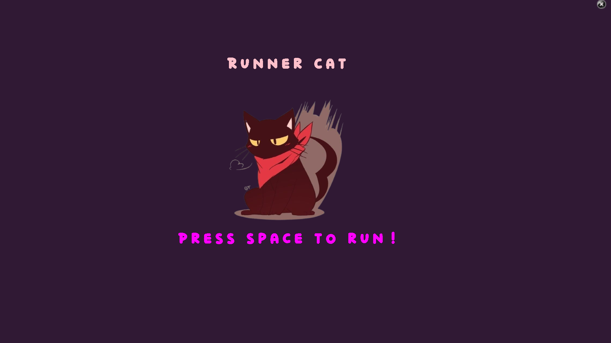

# 🐾 Advanced Keylogger with Cat Game Overlay (Educational Tool)

> ⚠️ **DISCLAIMER**  
> This project is strictly for **educational and ethical research purposes only**. Unauthorized or malicious use is illegal and unethical. Always obtain **explicit permission** before deploying or testing such software in any environment.

---

## 🎯 Overview

This project simulates a realistic malware scenario, designed to educate students, researchers, and cybersecurity professionals on how keyloggers operate — with an added twist: a **Cat Game overlay** to distract users while data is collected silently in the background.

---

## 🛡️ Features

- 🎹 **Keystroke Logging** – Records all keyboard inputs.
- 📋 **Clipboard Monitoring** – Logs contents copied to clipboard.
- 🖼️ **Screenshot Capture** – Takes screenshots every second.
- 🖥️ **System Information Retrieval** – Gathers OS and hardware details.
- 📧 **Email Exfiltration** – Sends encrypted logs to a configured email address.
- 🕹️ **Cat Game Overlay** – Chrome Dino-style cat game to distract users.

---

## 🕹️ Cat Game Interface

While the keylogger silently collects data in the background, the user plays a fullscreen **Cat Game** that acts as a decoy.

### 🎮 Cat Game Screenshots

  
*Simple and playful cat character with obstacle elements.*

  
*Engaging interface to keep the user occupied.*

---

## 🔧 Background Logging in Action

Meanwhile, these background processes execute silently:

### 🖥️ Logger Screenshots

  
*Real-time logs of keystrokes, clipboard, and user data.*

  
*Collected system info, active screenshot capturing visible.*

---

## ⚙️ How It Works

1. The Python script launches silently.
2. A fullscreen **Cat Game** is displayed to distract the user.
3. **Keystrokes**, **clipboard content**, and **screenshots** are logged.
4. Logs are **encrypted** and **emailed** to a specified address.
5. Game keeps the user engaged while activities remain hidden.

---

## ⚙️ Requirements

- Python 3.7 or higher
- Install dependencies:
  ```bash
  pip install pynput pyautogui pygame
